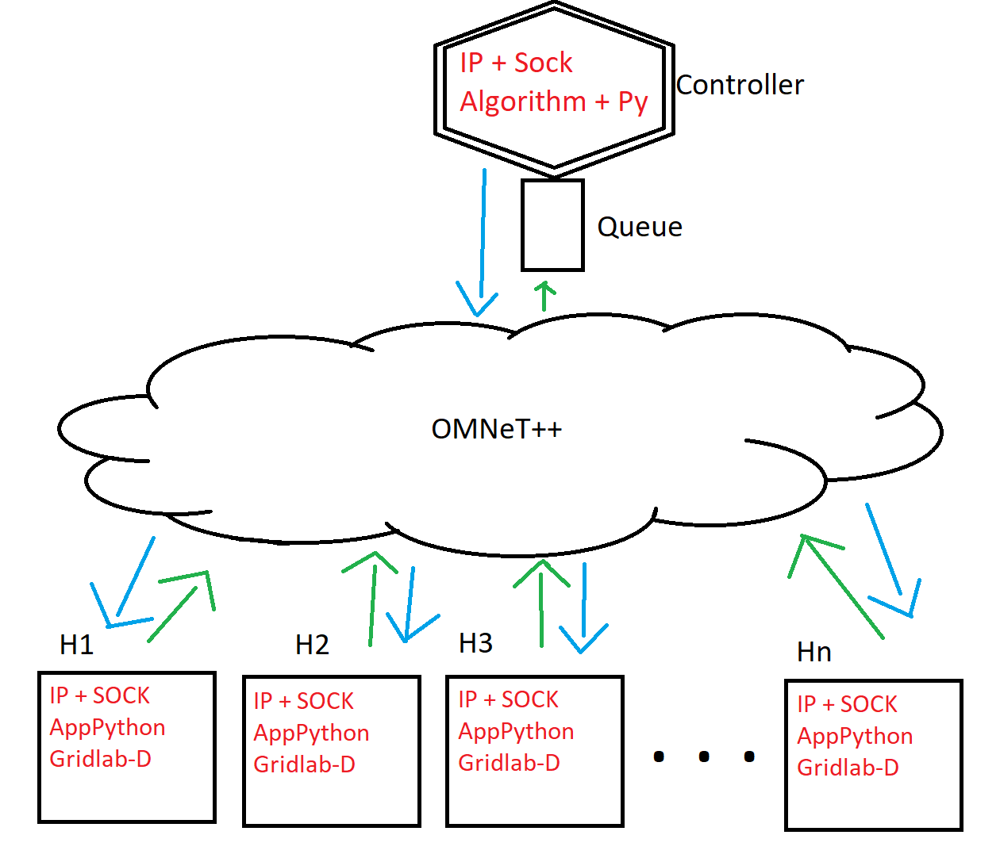

# phd-project

## Agenda

### Próximos encontros:
- [x] Checkpoint 01 - 19/09/2022;

### Objetivos:

- [x] Container rodando o GridLAB-D;
- [x] Script Python Gerando o arquivo.gml;
- [x] Integração do Script com o GridLAB-D do container;
- [] Integração e desenvolvimento da aplicação de simulação da casa (em andamento);
- [] Desenvolvimento da aplicação que simula a controladora da microgrid;
- [] Criação dos Sockets no OMNetpp;
- [] Criação da rede no OMNetpp;
- [] Integração do Omnetpp com as demais aplicações.

